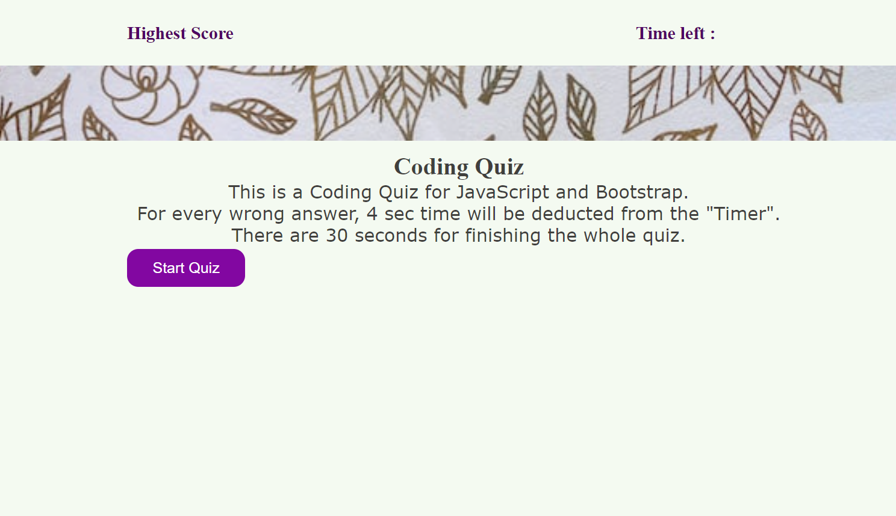

# MCQ_Quiz_using JS

## Description

- Personal-work: Created a coding quiz using HTML, CSS, JS.
- This challenge emphasized the use of JavaScript to provide questions and collect user inputs to determine whether the answer is correct or wrong. There is a timer decreasing gradually unless the user chooses the wrong input. Every wrong input deducts some time from the main timer. The final score is the user's score.
- This project helped me to learn more about how to use logic in JavaScript and different types of API uses.
 
## Installation

To run the application successfully, we need Microsoft Visual Studio as an editor, Git Bash to clone the github repo and Chrome Dev Tools to inspect the code.

## Task 

-	HTML and CSS is used to design the interface.
-	JavaScript documents helped to create the coding quiz with multiple-choice questions.
-	This homework emphasized the importance of using JavaScript web APIs to make dynamic changes to an HTML document.
-	Different event listeners and functions were implemented for user convenience.

## Usage

To see my homework, please go to : https://thalim-glam.github.io/MCQ-Quiz/

Here is a sample screenshot showing partial view og my project

## Comand line code

I used a lot of git commands like :
- git status
- git add -A
- git commit -m "Comment goes here"
- git branch
- git push
- git pull origin main
- git checkout main
- git checkout -b feature/add-branch

## Credits

Apart from me :D the credit also goes to my Instructor, TAs, Tutor, Classmates, and 
- Google (my guide everytime I got stuck and lost!)
- Geeks for Geeks
- Stack Overflow
- MDN web doc
- Github docs
- Tutorials Teacher

## Features

In my code I had 1 main branch and crated a few featured branch to test my code and update.
  - I had to create everything from the scratch
  - Added the screenshot and 
  - Used console.log and inspect to debug my work

## Tests

To test the homework, 
  - Please follow the deployed website link. 
  - Click the "START" button to start the quiz.
  - You can test the quiz different ways.
  - You can check the "Console" to see some of my checking messages.
  - I have put lots of comments inside the my code for my understanding.s

### Done By: Tasneem Halim
